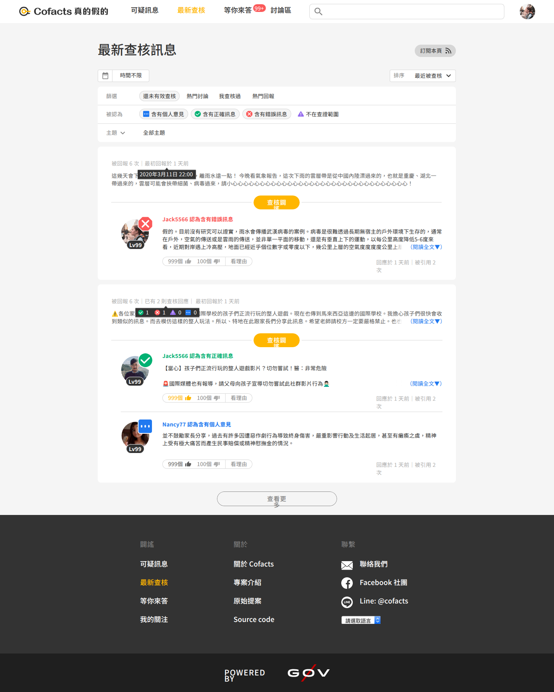
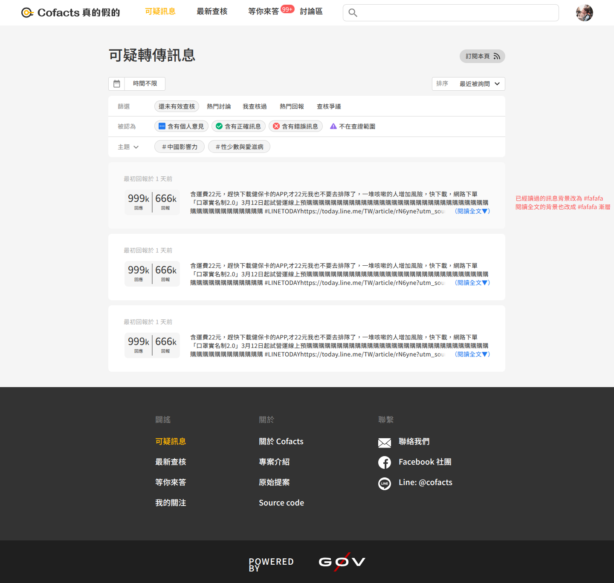
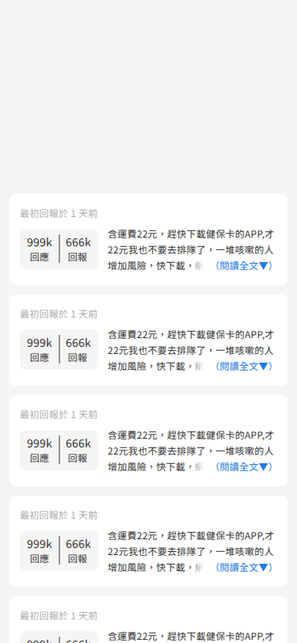
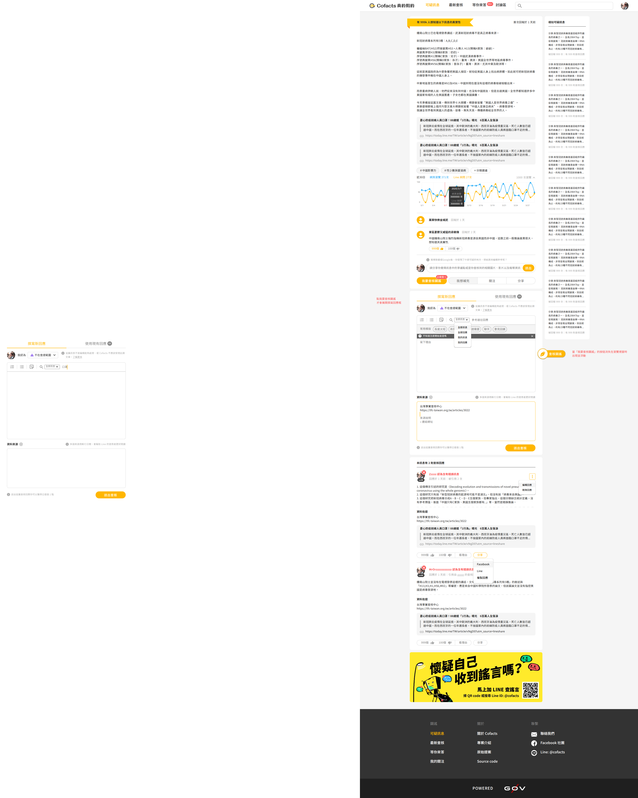
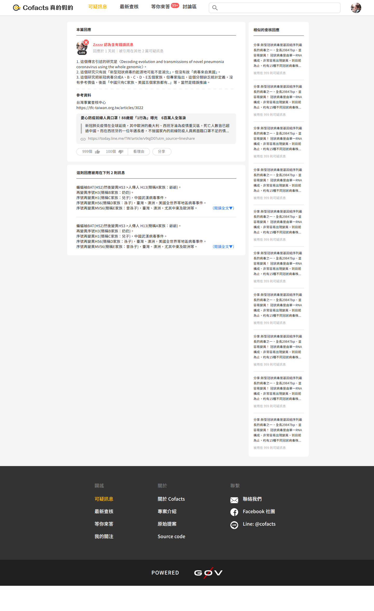
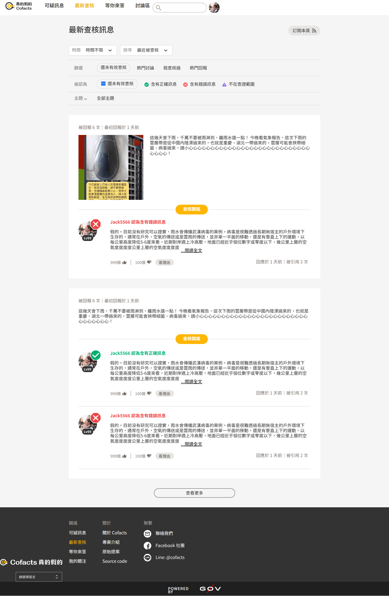
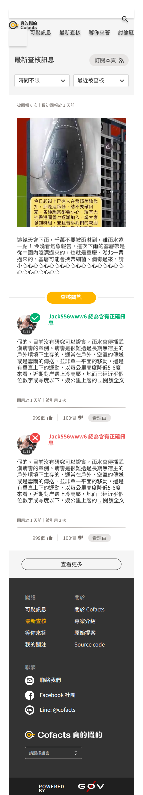
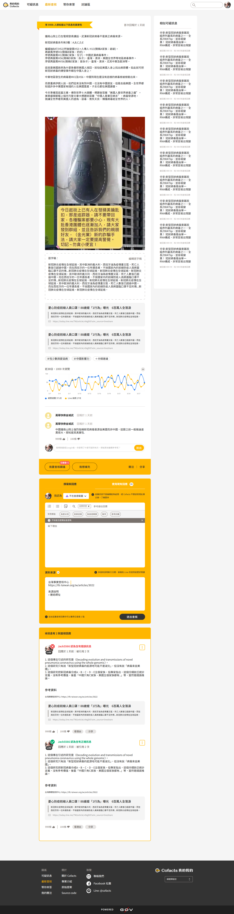
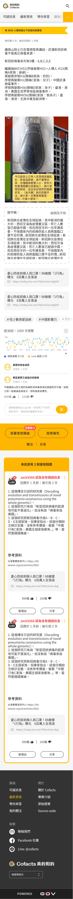

# Handoff: Cofacts Design System & Website Mockup Reorganization

Hello! This document contains the full context, progress, and TODOs for the Cofacts Design System modernization project.

The goal of this project is to create a robust, token-driven design system inside **Pencil** (`.pen` files), which can act as the source of truth for the codebase (`rumors-site`), specifically tracking both a foundational component library (`design.lib.pen`) and the final responsive mockups (`website.pen`).

### ⚠️ IMPORTANT: Pencil MCP File Constraint ⚠️
The Pencil MCP can only have **one `.pen` file active at a time**. When switching between `design.lib.pen` and `website.pen`, explicitly call `open_document` with the target file path before performing operations.

---

## What Has Been Completed So Far

1. **Tokens Defined & Generated:** All design tokens (Colors, Typography, Spacing) are programmed into `design.lib.pen` as variables under the `State` / `Theme` theme dimensions.
2. **Reference Components Collected:** Raw component shapes from the old "Cofacts - new design" Penpot file are preserved in `design.lib.pen` under the "Previous references" group.
3. **Atoms Built in `design.lib.pen`:**
   - **ReplyTypeIcon** — sm/md/lg × NotRumor/Rumor/NotArticle/Opinionated
   - **Button** — Primary, Outlined, Secondary, Text (all pill-shaped, with label / icon-right variants), plus IconOnly (Primary, Outlined, Secondary, Text) in square 32×32
   - **Avatar-lg** (90×88) and **Avatar-sm** (52×52) — circular image + optional BackgroundBadge ring, StatusIcon (top-right), LevelBadge (bottom)
   - **Pill** — selectable chip (Default/Hover/Active theme via `$--pill-bg` / `$--pill-border`)
   - **PillWithIcon** — Pill with a slot frame for a ReplyTypeIcon-sm (filled per-instance via `descendants:{type:"ref"}`)
   - **Dropdown** — label prefix + value + Material Symbols chevron, white bg, gray border
4. **Molecules Built in `design.lib.pen`:**
   - **FeedbackControl** — thumbs-up count / thumbs-down / 看理由 button row
   - **SearchInput-Collapsed** — 40×40 icon-only search button
   - **SearchInput-Expanded** — pill-shaped input with search icon + placeholder
   - **NavTabs-Mobile** — 375px × 45px, 4 tabs + MoreButton, active tab underline
   - **NavTabs-Desktop** — inline tabs 60px tall, active tab in yellow
   - **FilterBar** — ToolsRow (2 Dropdowns) + FiltersPanel (篩選 pills / 被認為 PillWithIcons / 主題 expand row)

## Pending Tasks (TODOs)

1. **Finish Remaining Molecules in `design.lib.pen`**
   - **ArticleReplySummary**: Username + reply type badge + text preview

2. **Build Organisms in `design.lib.pen`**
   - **AppHeader**: Mobile (logo + NavTabs-Mobile + search) / Desktop (logo + NavTabs-Desktop + SearchInput-Expanded + user avatar)
   - **AppFooter**: 3-column + bottom bar
   - **AppSidebar**: Mobile drawer (dark bg, links, member-ribbon)
   - **ArticleCard**: List item with info box, text preview, FeedbackControl
   - **ReplyCard**: Reply in Latest Replies page
   - **ReplyItem**: Reply within Article Detail

3. **Create `website.penpot`**
   - After all components are ready, publish the library.
   - Build 4 core RWD page mockups (375px mobile, 1440px desktop) using the components.

4. **Codebase Implementation (Optional next step)**
   - Enforce Tokens into `rumors-site` codebase using Tailwind CSS or updating `theme.tsx`.

---

## Design Tokens Specs

*(Already injected into `design.lib.pen` as variables).*

### Colors
- **Brand:** `color.red1` (#FB5959), `color.orange2` (#FFB600), `color.green1` (#00B172), `color.blue1` (#2079F0)
- **Primary Scale:** `primary.500` (#FFB600), etc.
- **Secondary Scale:** `secondary.500` (#333333), `secondary.100` (#D6D6D6), `secondary.50` (#F5F5F5)
- **Semantic:**
  - `bg.default`: #F5F5F5
  - `bg.surface`: #FFFFFF
  - `text.primary`: #333333
  - `text.secondary`: #858585
  - `border.default`: #D6D6D6
  - `error`: #FB5959

### Typography Scale (Noto Sans TC)
| Name | Size | Weight | Letter Spacing |
|------|------|--------|----------------|
| H1 | 32px | 500 | 0 |
| H2 | 28px | 500 | 0 |
| H3 | 24px | 500 | 0 |
| H4 | 20px | 500 | 0 |
| H5 | 18px | 500 | 0 |
| Subtitle-Large-B | 18px | 500 | 0.15 |
| Subtitle-Large-R | 18px | 400 | 0.5 |
| Subtitle-Small | 16px | 700 | 0 |
| Body-1 | 16px | 400 | 0 |
| Link | 16px | 500 | 0 |
| Body-2-B | 14px | 700 | 0.25 |
| Body-2-M | 14px | 500 | 0.25 |
| Body-2-R | 14px | 400 | 0.75 |
| Body-3-B | 12px | 700 | 0.25 |
| Body-3-R | 12px | 400 | 0.25 |
| Body-4-B | 10px | 700 | 0.25 |
| Body-4-R | 10px | 400 | 0.25 |

### Spacing & Layout
- `radius.default`: 8px
- `breakpoint.md`: 768px
- `size.navbar`: 60px
- `size.tabs`: 45px

---

## Component Inventory Remaining (`design.lib.pen`)

### Molecules
- **ArticleReplySummary**: Username + reply type badge + text

### Organisms
- **AppHeader**: Mobile (logo + tabs + menu) / Desktop (logo + tabs + search)
- **AppFooter**: 3-column + bottom bar
- **AppSidebar**: Mobile drawer
- **ArticleCard**: List item with info box, text preview
- **ReplyCard**: Reply in Latest Replies page
- **ReplyItem**: Reply within Article Detail

---

## Key Component IDs in `design.lib.pen`

| Component | Node ID |
|-----------|---------|
| ReplyTypeIcon-NotRumor-sm/md/lg | yZSyl / qS08H / bWAy6 |
| ReplyTypeIcon-Rumor-sm/md/lg | jGLNa / 2d2ww / C33pC |
| ReplyTypeIcon-NotArticle-sm/md/lg | uVpjh / HY1sM / 6IJ2m |
| ReplyTypeIcon-Opinionated-sm/md/lg | c5ctU / WsSgR / wu4qq |
| Button-Primary | xk3eQ |
| Button-Outlined | LtzgX |
| Button-Secondary | IuDjq |
| Button-Text | y1yRN |
| Button-Primary-IconRight | BPVN6 |
| Button-Outlined-IconRight | q3O8L |
| Button-Secondary-IconRight | UwGwf |
| Button-Text-IconRight | rI0CX |
| Button-Primary-IconOnly | 9Coz9 |
| Button-Outlined-IconOnly | PlMqd |
| Button-Secondary-IconOnly | TEGWK |
| Button-Text-IconOnly | xcC7B |
| Avatar-lg | kQYGh |
| Avatar-sm | qcTGX |
| FeedbackControl | ndZfd |
| Pill | GRgur |
| PillWithIcon | H0Dfw |
| Dropdown | ZHS8n |
| SearchInput-Collapsed | 0qfbe |
| SearchInput-Expanded | gosVx |
| NavTabs-Mobile | nSAZ0 |
| NavTabs-Desktop | tifyW |
| FilterBar | FQEsB |

---

## Screenshot References

All screenshots representing the 2019 baseline and the newer baseline designs have been copied to the `./screenshots` directory in this workspace.

### 2019 Design Visual Reference

````carousel

<!-- slide -->

<!-- slide -->

<!-- slide -->

<!-- slide -->

<!-- slide -->

````

### New Design Visual Reference

````carousel

<!-- slide -->

<!-- slide -->

<!-- slide -->

````

Good luck handling the Penpot MCP executions! The user is ready to continue.
