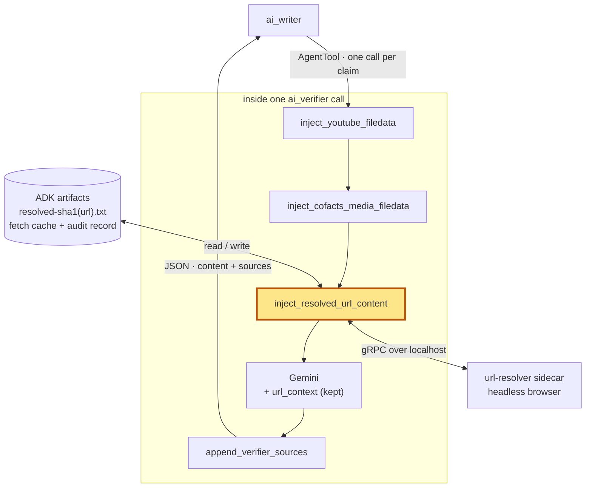
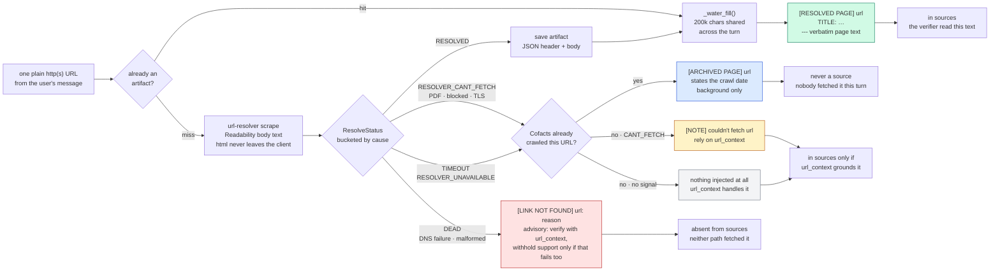

# Pre-fetch real page text for the verifier via url-resolver

## Context and Problem Statement

[`20260515-agent-source-integrity-contract`](20260515-agent-source-integrity-contract.md) made
the `ai_verifier` the single source of truth for "which URL backs which claim", and the writer
may only cite what the verifier marked ✓. That contract guarantees **provenance** — the writer
copies URLs instead of inventing them — but it does not guarantee the verifier **actually read
the page**. The verifier's only eyes are Gemini's built-in `url_context` tool, a black box: when
it silently returns nothing for a URL, nothing in the pipeline notices, and the model fills the
gap from training knowledge. The result is the failure mode the contract was supposed to end,
relocated one step upstream: a ✓ against a link that is dead, or that simply does not contain
the claim.

Three months of dogfooding feedback (Langfuse `user-thumbs`, 2026-04-22 → 2026-07-21: 130
ratings, 80 of them negative) put **27 reports — 20.8% of all feedback and 33.8% of downvotes —
in this one category**, making it the single largest complaint about the system and, in the
team's words, 「最高頻、最傷信任的問題」 (the most frequent and most trust-damaging problem).
Monthly share showed no improvement across the window (May 25%, June 17%, July 23%), i.e. the
prompt-level rules shipped in #55/#77 had not closed it.

Scope: the ADK verifier's perception layer only — `ai_verifier`'s `before_model_callback` chain
(`adk/cofacts_ai/resolved_pages.py`) and `after_model_callback` (`agent.py`), plus a new gRPC
client package and a new
internal service dependency ([`cofacts/url-resolver`](https://github.com/cofacts/url-resolver))
in the deploy topology. The writer, the investigator and the `claim_sources` gate are unchanged.
Driving PR: [cofacts/ai#118](https://github.com/cofacts/ai/pull/118).

### Langfuse evidence

- [Honey session `fcbe502f` / trace `93095969`](https://langfuse.cofacts.tw/project/cmm0emerr0001qi07eugd0760/traces/93095969a5b796d9555915dbdd014d99) —
  the clearest case. The fact-checker reported 「Verifier 被輸入四個錯的網址（都點不進去），結果
  verifier 幻覺說支持。」 The trace confirms it: `agent_run [verifier]` emitted
  `✓ **Supported**` for a PanSci article **together with a verbatim 「」 quotation** —
  manufactured wholesale, since the page it cites does not resolve. Analysis: the verifier does
  not merely guess when `url_context` comes back empty, it fabricates supporting evidence in the
  exact shape the output format asks for, which is indistinguishable from a real ✓ downstream.
  The same session was downvoted twice for the same cause
  ([trace `6ba8807d`](https://langfuse.cofacts.tw/project/cmm0emerr0001qi07eugd0760/traces/6ba8807db7391cb36fac1c26ac0fee8f),
  「這兩個不存在」).
- [Trace `1b430b76`](https://langfuse.cofacts.tw/project/cmm0emerr0001qi07eugd0760/traces/1b430b765b5152f9388fd2de3b1f1433)
  (session `889941dc`, 2026-05-15) — 「`heho.com.tw/archives/378892` 醫學專業網站：龍葵鹼中毒症狀與處理建議」是錯的，裡面沒有中毒症狀. Analysis: the second sub-mode — the URL is
  **live**, so no reachability check would catch it; the page simply lacks the claimed content.
  Fixing dead links alone is insufficient.
- [Trace `bd7188e5`](https://langfuse.cofacts.tw/project/cmm0emerr0001qi07eugd0760/traces/bd7188e56175010efdec09d4937a31a3)
  (session `1ae58e74`, 2026-06-24) — the fact-checker checked the cited book by hand: 「我翻找
  Things Chinese 這本書，裡面根本沒說 Four is an unlucky number 那句話。」
- [Trace `bfb7c047`](https://langfuse.cofacts.tw/project/cmm0emerr0001qi07eugd0760/traces/bfb7c047dc5542588c9fec584e950b56)
  (session `9d23432c`, 2026-07-06) — 「Verifier 胡謅」: a fabricated citation of a Hong Kong
  Legislative Council record, page number included.
- [Trace `8e672492`](https://langfuse.cofacts.tw/project/cmm0emerr0001qi07eugd0760/traces/8e672492da6cde37bf2dd09aa85ad10f)
  (session `eff1ce5b`, 2026-07-11) — 「我都貼了 privacy 他卻還在用不存在的
  `https://www.cmoney.tw/policy/privacy`」. Analysis: the model preferred a _plausible-looking_
  URL it had invented over the real one pasted into its own context.

The 2026-06-16 weekly review ([cofacts/kb](https://github.com/cofacts/kb)
`src/meetings/2026/20260616.md`) reached the same conclusion independently, tracing the chain
「investigator 搜尋出幻覺 URL，verifier 拿到壞 URL 後依然宣稱『支持』」 and stating the
requirement this record implements: 「對無法存取的 URL 不應產出「支持/反對」結論」.

## Decision Drivers

- A ✓ must be **evidence the page was read**, not a claim that it was. `url_context` returning
  nothing must be distinguishable from `url_context` returning support.
- Both sub-modes must be addressed: of the 27 reports, 11 carry a **dead-link** signal
  (「提供不存在的出處」/「瞎掰」) and 20 a **content-mismatch** signal
  (「出處摘要錯誤」/「回應文字與出處不符」/「胡謅」), with 4 carrying both. A reachability probe
  alone would leave the larger group untouched.
- The verifier's output format demands **verbatim quotes**, so whatever we feed it must be the
  page's real text, not a paraphrase — a summary layer would let an unsupported source read as
  supporting.
- `url_context` cannot simply be replaced: it is the only path to YouTube **video content** and
  page **metadata** (upload date, uploader), which url-resolver — an HTML scraper — cannot
  provide. Per the ADK constraint recorded in
  [`20260515`](20260515-agent-source-integrity-contract.md), a built-in tool cannot share an
  agent with function-calling tools, so anything added as a _tool_ would force `url_context` out.
- A fetcher failure must never be mistaken for proof that a URL is fake, or a resolver outage
  would brand good sources dead and silently degrade verification.
- Keep the verifier a **verifier**: the fix belongs at the confirmation gate, not spread across
  the pipeline.
- LLM context and cost must stay bounded, and the raw HTML url-resolver returns (100 KB+ per
  page) must never reach a model.

## Considered Options

Reconstructed from the design discussion on #118 (the maintainer proposed the first three
placements; the fourth emerged in review):

- **url-resolver as a general tool** — expose it to the pipeline as a function tool.
- **url-resolver as the verifier's tool** — the verifier decides which URLs to read.
- **Pre-resolution in a `before_model_callback`** — the system fetches every plain web URL
  before the verifier's model call and injects the cleaned text. **Chosen.**
- **A dedicated resolver sub-agent behind `AgentTool`** — isolate fetching and summarizing in
  its own agent so bulk text never enters the orchestrator's context.

## Decision Outcome

Chosen option: **pre-resolution in a `before_model_callback`, keeping `url_context`**, because
it is the only option that makes reading **non-optional**. The real page text is already in the
verifier's context before it produces a token, so there is no code path in which it "forgets" to
read and falls back to training knowledge — which is precisely how the two tool-shaped options
fail: a tool the model may skip is a tool the model will sometimes skip, and that is the bug. A
callback is not a tool, so it also sidesteps the ADK built-in-tool constraint entirely and lets
`url_context` stay for video and metadata. The sub-agent option was rejected as a _fix_ (it
isolates context nicely but leaves the verifier reading through the same black box) and is
retained only as a possible future writer-side convenience.

### Where the hook sits

`inject_resolved_url_content` is a third `before_model_callback` on `ai_verifier`, alongside the
two that already inject media. Being a callback rather than a tool is the whole point: it runs
between the request being assembled and Gemini seeing it, so the page text is in context before
the model produces a token. There is no branch in which the model "skips the tool".

### What it does to the content

Each plain web URL in the message becomes one of four things in the request. The split is by
**cause of failure**, not by success/failure, because that is what decides whether the verifier
is allowed to treat a URL as bad — and, downstream, whether the page can appear in `sources`.

The right-hand column is the self-correcting property: no ban list decides what may be cited.
A dead URL is fetched by neither path, so it is simply absent; a PDF the resolver cannot read
still appears if `url_context` grounded it.

As shipped in #118:

1. **A gRPC client for url-resolver** (`adk/cofacts_ai/url_resolver/`). The `.proto` files are
   vendored from `cofacts/url-resolver` and the stubs are generated by
   `adk/scripts/gen_protos.sh` and **committed**, so the runtime image needs only `grpcio`, not
   `grpcio-tools`. `resolve_urls()` consumes the server-streaming `ResolveUrl` RPC, joins replies
   back to the request **by URL** (stream order is not guaranteed), and **drops `html`
   unconditionally** — the one non-negotiable rule of the module.
2. **Resolver failures are bucketed by cause, not lumped together.** Only
   `NAME_NOT_RESOLVED` / `INVALID_URL` become `DEAD` (the URL itself is bad). Everything else —
   `UNSUPPORTED` (a PDF), `NOT_REACHABLE`, `HTTPS_ERROR`, scrap/unfurl errors — becomes
   `RESOLVER_CANT_FETCH`, meaning _the resolver_ failed, not the page; `url_context` may still
   read it. A whole-call failure yields `RESOLVER_UNAVAILABLE` for every URL, never `DEAD`.
3. **`inject_resolved_url_content` as a third `before_model_callback`** on `ai_verifier`,
   alongside the existing `inject_youtube_filedata` / `inject_cofacts_media_filedata`. The whole
   pipeline — CJK-aware URL extraction, the artifact envelope, budgeting and the callback itself
   — lives in `adk/cofacts_ai/resolved_pages.py`, the way media injection lives in
   `media_filedata.py`; `agent.py` keeps only the agent wiring and `append_verifier_sources`,
   which sits beside `append_grounding_sources` because the two share the `{content, sources}`
   contract. It injects
   one **text** part per URL (`FileData` is reserved for binary media Gemini perceives natively):
   `[RESOLVED PAGE] <url>` with the real Readability-cleaned body text; `[LINK NOT FOUND]` for
   `DEAD`; and for `RESOLVER_CANT_FETCH` / `TIMEOUT` / `RESOLVER_UNAVAILABLE` either an
   `[ARCHIVED PAGE]` copy if Cofacts has one (item 10) or, failing that, a one-line note or
   nothing at all — so a URL the resolver could not read still falls through to `url_context`.
   YouTube and Cofacts `gs://` media URLs are excluded — they are handled by the sibling
   callbacks.
4. **`[LINK NOT FOUND]` is advisory, not a ban.** It instructs the verifier to try `url_context`
   anyway and to withhold support only if that _also_ retrieves nothing. url-resolver's simpler
   fetch failing is not proof a page does not exist.
5. **Raw text, budgeted across the turn.** All resolved pages are injected **in full** while
   their combined length fits `URL_RESOLVER_TOTAL_CHAR_BUDGET` (default 200 000 chars); only on
   overflow does a max-min fair allocation trim the longest pages, leaving short ones whole. Text
   is never summarized — the verifier must quote verbatim. Archived copies (item 10) share the
   same budget: they cost the same context as a fresh page.
6. **The artifact store doubles as the fetch cache.** Full page text is saved as
   `resolved-<sha1(url)>.txt`, which serves three purposes at once: the cache read that avoids
   re-fetching across the verifier's ~2 model calls per turn (and across turns in a session), the
   full text for when the injected copy was trimmed, and — since the frontend already renders
   artifacts — an auditable record of exactly what page content the system was able to read,
   available to show a human the evidence a verdict rests on.
7. **`sources` becomes a union instead of a filtered list.** `append_url_context_sources` is
   replaced by `append_verifier_sources`, which unions the pages url-resolver actually resolved
   (carried forward in `temp:cofacts_resolved_meta`) with `url_context`'s grounding chunks. This
   is self-correcting with no ban list: a genuinely dead URL is fetched by neither path, so it is
   simply absent and can never reach the `claim_sources` gate; a PDF url-resolver missed but
   `url_context` grounded still appears. It also now wraps the response when `url_context`
   returned no grounding at all, so a model that skips it no longer discards the
   deterministically fetched sources too. Item 10 adds a third category the union deliberately
   does not cover: text that is injected but never cited.
8. **Verifier prompt rewritten around the new division of labour**: body text from the injected
   `[RESOLVED PAGE]` parts, metadata / upload date / video content from `url_context` — whose
   MUST-call mandate is _kept_, since it remains the fallback and the only source of metadata.
   `[ARCHIVED PAGE]` carries its own rule: background only, never a source, and `url_context`
   wins over it wherever the two disagree.
9. **Internal-only deployment.** url-resolver is insecure gRPC with no auth and is never exposed
   externally: in production it shares the docker-compose network (`URL_RESOLVER_ADDRESS=url-resolver:4000`),
   and on Cloud Run it runs as an adk sidecar over `localhost`.

10. **Cofacts' own earlier crawl is the last-resort fallback** (added in
    [#136](https://github.com/cofacts/ai/pull/136)). An article or reply already carries
    `hyperlinks`: page text Cofacts' url-resolver crawled when the message was processed — the
    same service and the same `summary` field, just resolved earlier. Where the live fetch fails
    but the page probably still exists (`RESOLVER_CANT_FETCH` and the two no-signal buckets),
    that copy is injected as `[ARCHIVED PAGE]` instead of nothing.

    Three things make it safe rather than a re-run of the problem this record exists to fix:
    - **It is never a source.** It is absent from `temp:cofacts_resolved_meta`, which is what
      item 7's union turns into `sources`. Injecting text the verifier may read while refusing
      to let that text be _cited_ is the whole point — a page nobody could fetch this turn must
      not reach a reader as one the verifier read.
    - **It is dated in the prompt.** `fetchedAt` — the one `Hyperlink` field the tool was not
      querying — is what makes the copy interpretable at all, and it cannot be inferred from the
      article: 2016 articles carry hyperlinks backfilled in 2018, and same-day articles carry
      ones crawled minutes later. A summary without its date is indistinguishable from an
      eight-year-old one.
    - **`DEAD` is excluded.** There the URL itself does not resolve, and pairing "this link is
      broken" with the text it served years ago invites exactly the citation item 4's advisory
      note exists to prevent.

    The data reaches the verifier through `temp:cofacts_hyperlinks`, harvested in the writer's
    `after_tool` where the response is still structured. The alternative — recovering it from
    the citation block the writer sends — would mean parsing a prompt: `resolve_citations`
    renders a cited tool result as flat text, and for `search_cofacts_database` that text is a
    whole JSON dump. Unlike `temp:cofacts_resolved_meta` this key accumulates and is never
    reset, because it is a URL-keyed lookup table rather than an assertion about one call: a
    stale entry there is merely old, and says so.

    Deliberately **not** done in the same change: skipping the live fetch when Cofacts' copy is
    fresh. The verifier's question is whether a link works and supports the claim _now_, so the
    re-fetch stays. Its cost is real — it also spends the 20-URL cap on URLs that already have
    text — and `fetchedAt` is what a future policy would need to weigh that.

Deliberately **not** done: an investigator-side pre-screen. The investigator is where several
bad URLs originate, but the architecture already designates the verifier as the gate
("INVESTIGATOR DISCOVERS, VERIFIER CONFIRMS"), so catching them there covers the
investigator-originated ones downstream while keeping each agent's role intact.

### Consequences

- Good, because reading is no longer optional: the verifier cannot produce a ✓ for a page whose
  text was never in its context, which removes the mechanism behind the fabricated-quote case
  above.
- Good, because it addresses **both** sub-modes with one change — dead links surface as
  `[LINK NOT FOUND]`, and live-but-irrelevant pages are exposed by having their real text present
  for the model to fail to find the claim in.
- Good, because a dead URL is now excluded from `sources` **structurally**, by not being fetched,
  rather than by a rule someone must maintain.
- Good, because the failure taxonomy degrades safely in both directions: a resolver outage falls
  back to today's behaviour instead of mass-marking sources dead, and a resolver limitation (PDF)
  hands the URL to `url_context` instead of suppressing it — and, since #136, to Cofacts' own
  earlier crawl of the same page before that.
- Good, because the fallback reuses data the pipeline already fetched. `hyperlinks` was being
  requested and discarded; the only new cost is one extra GraphQL field.
- Bad, because `[ARCHIVED PAGE]` puts text in front of the model that is true of the past and
  may be false of the present. The marker, the stated crawl date and the prompt rule are the
  whole defence, and they are instructions to a model rather than a structural guarantee — the
  structural part is only that the text cannot become a `source`.
- Good, because the cached full text gives fact-checkers and future debugging a record of what
  the system actually read — the artifact is evidence, not just a cache.
- Bad, because every page is now fetched **twice** (url-resolver's puppeteer and Gemini's
  `url_context`), adding latency and load; url-resolver re-scrapes per call with a 5 s per-URL
  fetch timeout, so a 20-URL batch can develop a long tail.
- Bad, because the ADK backend gains a **runtime dependency on another service**. It degrades
  gracefully, but when url-resolver is down the anti-hallucination guarantee silently reverts to
  the old `url_context`-only behaviour — the pipeline is quieter about this than an outage
  deserves.
- Bad, because head-truncation is naive: on an over-budget batch the trimmed tail of a long
  article is invisible to the verifier, which could turn a supported claim into a ✗. Claim-aware
  windowing is the intended upgrade if this bites.
- Bad, because the resolver-result handoff to `append_verifier_sources` travels through
  `temp:` session state. The after-model callback receives only the `LlmResponse` and cannot see
  the request it was built from, so the two halves of the `sources` union are necessarily
  computed at different times and stitched through state — another private convention in the
  same family as the `{content, sources}` contract.
- Bad, because injected page text still competes for attention: it is bounded, but a 200 000-char
  turn is real cost and real mid-context recall risk.

## Confirmation

- 33 new unit tests across three files (65 in the suite, all passing), network-free by faking the
  gRPC channel/stub and the artifact store. They pin the invariants that matter rather than the
  implementation: `html` never leaves the client; results join by URL, not stream order; each
  `ResolveError` value lands in the right bucket; a transport failure marks every URL
  `RESOLVER_UNAVAILABLE` and **never** `DEAD`; `RESOLVER_CANT_FETCH` injects nothing; the
  callback is idempotent across a turn and hits the artifact cache on a second turn; and a dead
  URL never appears in `sources` while a `url_context`-grounded PDF still does.
- `ruff check`, `ruff format --check` and `ty check` clean; protoc-generated stubs are excluded
  from both via `pyproject.toml`.
- Still open: the end-to-end check against a live url-resolver (Docker on `:4000`) confirming a
  known-dead URL is reported unreachable rather than supported, and that a good URL's report
  quotes text present in the injected `[RESOLVED PAGE]` part.
- The real measure is the feedback rate this record opens with: the share of `user-thumbs`
  downvotes citing 「提供不存在的出處」/「出處摘要錯誤」/「回應文字與出處不符」 should fall from
  its ~34% baseline. That is only observable in production over weeks, and is the reason this
  record stays `proposed` until #118 merges and the numbers move.

## More Information

- Implemented in [cofacts/ai#118](https://github.com/cofacts/ai/pull/118) — open as a draft at
  the time of writing, hence `status: proposed`. Update to `accepted` on merge.
- This record **extends** [`20260515-agent-source-integrity-contract`](20260515-agent-source-integrity-contract.md)
  rather than superseding it: that contract's provenance guarantee, discover-vs-confirm roles and
  `claim_sources` gate all stand unchanged. What changes is the verifier's evidence base — and
  one name from it, `append_url_context_sources`, which is now `append_verifier_sources`.
- It reuses the callback-injection pattern established by
  [`20260531-callback-media-injection`](20260531-callback-media-injection.md) and generalized in
  [`20260606-multimodal-perception-vertex-ai`](20260606-multimodal-perception-vertex-ai.md);
  `inject_resolved_url_content` is the third callback in the same chain and deliberately excludes
  the URL shapes those two own.
- Evidence and analysis: the Langfuse traces above, and the Cofacts weekly reviews in
  [cofacts/kb](https://github.com/cofacts/kb) `src/meetings/2026/` — `20260616.md` (the
  investigator→verifier hallucination chain and the requirement quoted above), with earlier
  instances in `20260515.md`, `20260602.md` and `20260609.md`.
- Revisit if: the double fetch proves too slow (drop `url_context` for non-video URLs and build
  `sources` from the resolver alone); truncation loses relevant passages (claim-aware windowing);
  or bad URLs are better killed at the source (an investigator-side pre-screen, deliberately out
  of scope here).
