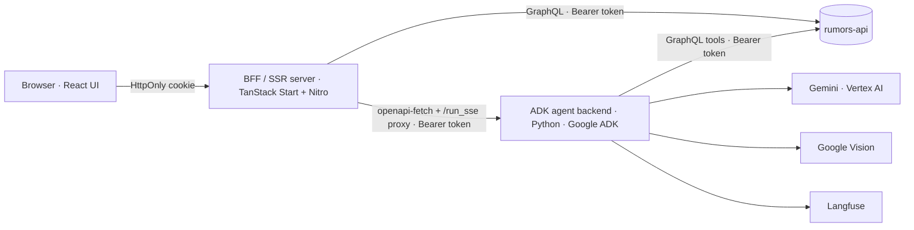

# Cofacts.ai — architecture overview

Cofacts.ai is a chat-based AI assistant for **collaborative fact-checking**. It helps human
fact-checkers (it does not replace them) triage suspicious messages reported to Cofacts,
research and verify claims, and draft fact-check replies. It builds on the existing Cofacts
`rumors-api` (article data + OAuth login), Google Gemini via Vertex AI (the agents), and
Langfuse (observability + feedback).

This page is the **current-state overview**. The _why_ behind each choice lives in
[`decisions/`](decisions/index.md) as MADRs — this page links out to them rather than
repeating them. See [`AGENTS.md`](../AGENTS.md) for how to keep both up to date.

## Two services

1. **Frontend + BFF** — a TanStack Start (React / Vite / Nitro) app at the repo root
   (`src/`). The browser talks _only_ to the BFF (server functions + `/api/*` routes). Auth
   is an HttpOnly `cofacts_session` cookie — the JWT never reaches browser JavaScript. The
   BFF proxies to the ADK backend and to `rumors-api`.
   → decision: [BFF auth](decisions/20260509-bff-auth-httponly-cookie.md).
2. **ADK agent backend** — a self-contained Python Google-ADK project under `adk/` (its own
   `pyproject.toml` / `Dockerfile`). A hierarchical multi-agent system (see below).

## How it starts

- **Dev:** `pnpm dev` runs both services with `concurrently` — the UI+BFF via `vite dev`
  (`:3000`) and the ADK backend via `uvicorn main:app` (`:8000`, API docs at `/docs`).
  One-time setup: `pnpm install`, then `pnpm install:agent` (`uv sync`), plus
  `gcloud auth application-default login` for Vertex AI. Two env files: root `.env`
  (browser/BFF) and `adk/cofacts_ai/.env` (agent).
- **Prod:** a single **Cloud Run** service with three containers — `ingress` (frontend/BFF),
  `backend` (ADK), and `cloudsql-proxy` — defined by `service.template.yaml` and deployed by
  `.github/workflows/deploy.yml`. Containers talk over `localhost`.
  → decisions: [Cloud Run multi-container deploy](decisions/20260303-cloud-run-multi-container-deploy.md),
  [Postgres session persistence](decisions/20260506-postgres-session-persistence.md).

## The ADK multi-agent system

The root agent is **`ai_writer`**, the orchestrator that composes fact-check replies. It
invokes sub-agents wrapped as ADK `AgentTool`s (the writer cannot call built-in tools such as
`google_search` / `url_context` alongside function tools in a single agent):

| Agent                                        | Role                                                                                                                      |
| -------------------------------------------- | ------------------------------------------------------------------------------------------------------------------------- |
| `ai_writer`                                  | Orchestrator. Triages, extracts claims, coordinates research + verification, drafts the reply. Perceives **images** only. |
| `ai_investigator`                            | **Discovers** candidate sources via `google_search`.                                                                      |
| `ai_verifier`                                | **Confirms** which source backs which claim via `url_context`; the only agent that perceives **video / audio**.           |
| `ai_proofreader_{kmt,dpp,tpp,minor_parties}` | Role-play Taiwan political perspectives to test the reply's neutrality.                                                   |

The `ai_` prefix is only the Python variable name in `adk/cofacts_ai/agent.py`; the ADK runtime
names — the `name=` strings, mirrored in `src/lib/adk.ts` — drop it: `writer`, `investigator`,
`verifier`, `proofreader_*`.

Agents exchange data through callbacks in `adk/cofacts_ai/agent.py` (a structured
`{content, sources}` JSON contract), and media is injected as Gemini `FileData` through
before-model callbacks in `adk/cofacts_ai/media_filedata.py` and `agent.py`.
→ decisions:
[source-integrity contract](decisions/20260515-agent-source-integrity-contract.md),
[media injection via callbacks](decisions/20260531-callback-media-injection.md),
[multimodal perception on Vertex AI](decisions/20260606-multimodal-perception-vertex-ai.md),
[auth token via ContextVar](decisions/20260603-auth-token-contextvar.md).

## Data & sessions

ADK sessions are persisted with `DatabaseSessionService` — SQLite locally, PostgreSQL via the
Cloud SQL proxy in prod. Chat artifacts (e.g. the Google-search suggestion widget, uploaded
files) are stored in GCS.
→ decision: [Postgres session persistence](decisions/20260506-postgres-session-persistence.md).

## Observability

Every model turn is traced to **Langfuse**; thumbs-up/down feedback is written back as
Langfuse scores (the secret key stays server-side, proxied through the BFF). Trace-driven
debugging is the team's standard workflow — most decisions here cite the trace that exposed
the problem.

## Invariant

`src/lib/adk.ts` (`AllTools`, the frontend's tool-name → args/response map) must be kept in
**strict sync** with `adk/cofacts_ai/tools.py` and `agent.py`. Changing a tool's shape means
changing both.
